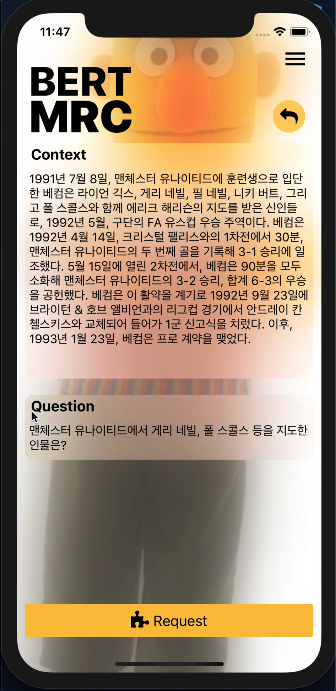

# BERT QA Application
BERT QA Fullstack using React-native, node.js, tensorflow

### 1. 개요
korquad를 이용해 지문과 질문이 주어졌을 때, 답변해주는 질의응답 Application.  
App, Server, BERT QA serving 구현

### 2. 구조
- App: React-native 
- Nodejs server: Node.js & Express
- DB: MongDB
- servingBERT: python, flask, 
- Data: korquad 1.0
- etc: tensorflow

### 3. 서비스 화면 
#### 3.1 App Intro  
{: width=200}

#### 3.2 App Navigation
{: width=200}
#### 3.3 BERT MRC main
{: width=200}
#### 3.4 BERT MRC 
서버로부터 임의의 지문과 질문 데이터를 받음.
{: width=200}
#### 3.5 
지문과 질문 데이터에 대한 MRC 결과 
{: width=200}

### References
- [korQuAD-beginner](https://github.com/graykode/KorQuAD-beginner)
- [Colab을 이용한 BERT-Base Model 학습하기](https://blog.nerdfactory.ai/2019/04/25/learn-bert-with-colab.html)
- [BERT 톺아보기](http://docs.likejazz.com/bert/)
- [풀잎 NLP Bootcamp](https://www.quantumdl.com/entry/12%EC%A3%BC%EC%B0%A82-BERT-Pre-training-of-Deep-Bidirectional-Transformers-for-Language-Understanding?category=691904)
